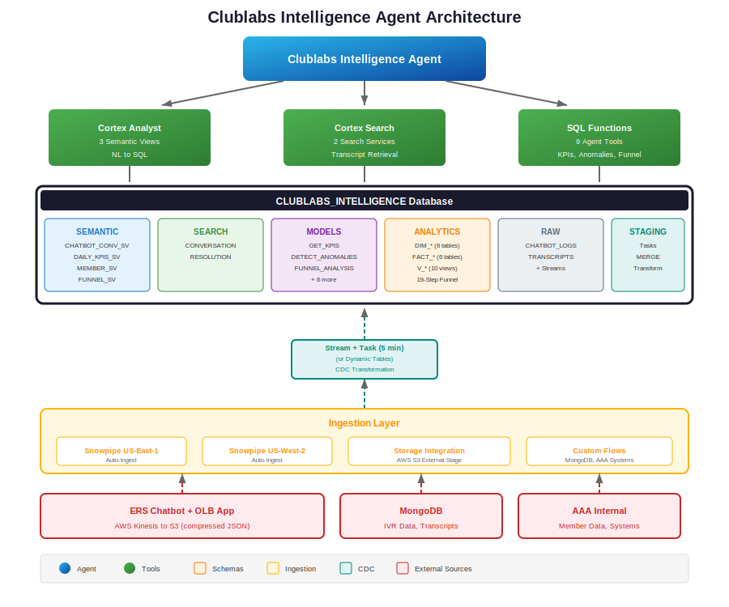
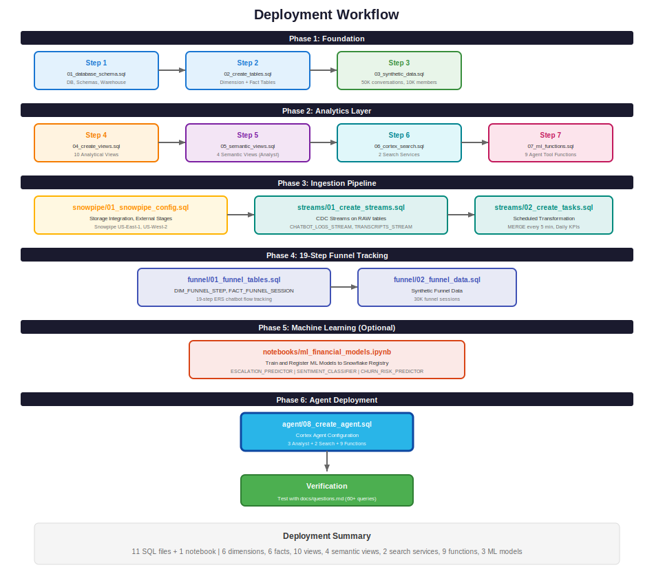
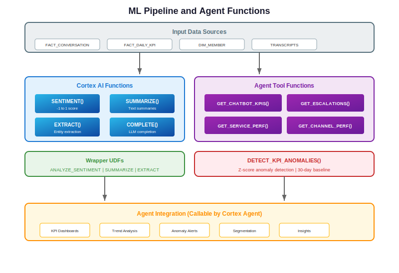

# Clublabs Intelligence Agent

An enterprise-grade AI-powered analytics platform for Emergency Roadside Services (ERS) chatbot performance analysis, built on Snowflake Cortex. This project implements a streaming-first ELT pipeline that transforms raw application logs into actionable insights through natural language queries.

## Project Overview

The Clublabs Intelligence Agent addresses critical operational challenges in managing AAA's ERS chatbot and Online Bind (OLB) applications. It replaces fragmented, manual data acquisition processes with a modern, scalable data architecture that enables:

- **Real-time Analytics**: Near real-time visibility into chatbot performance and user behavior
- **Natural Language Queries**: Ask questions in plain English, get SQL-backed answers
- **Proactive Monitoring**: Automated anomaly detection and daily operational digests
- **19-Step Funnel Analysis**: Granular tracking of user progression through the ERS chatbot flow

## Architecture



### Data Flow

<table>
<tr><th>Layer</th><th>Components</th><th>Description</th></tr>
<tr><td><b>Sources</b></td><td>ERS Chatbot, OLB App, MongoDB, AAA Systems</td><td>Application logs, IVR data, member information</td></tr>
<tr><td><b>Ingestion</b></td><td>Snowpipe (Auto-Ingest), S3 External Stages</td><td>Continuous ingestion from us-east-1 and us-west-2</td></tr>
<tr><td><b>Staging</b></td><td>RAW schema, Streams</td><td>VARIANT columns for semi-structured JSON, CDC tracking</td></tr>
<tr><td><b>Transformation</b></td><td>Tasks (MERGE)</td><td>5-minute scheduled transformation to star schema</td></tr>
<tr><td><b>Analytics</b></td><td>ANALYTICS schema</td><td>6 dimension tables, 6 fact tables, 10 views</td></tr>
<tr><td><b>AI/ML</b></td><td>Cortex Agent, Analyst, Search</td><td>Natural language interface, semantic search</td></tr>
</table>

## Key Features

### 1. AI-Powered Analytics Agent
The Cortex Agent combines multiple tools to answer complex questions:
- **Cortex Analyst**: Converts natural language to SQL via 4 semantic views
- **Cortex Search**: Semantic search over 10K+ conversation transcripts
- **SQL Functions**: 9 specialized functions for KPIs, anomaly detection, funnel analysis

### 2. 19-Step Funnel Tracking

Complete visibility into the ERS chatbot user journey:

<table>
<tr><th>Step</th><th>Name</th><th>Category</th></tr>
<tr><td>1</td><td>Landing Page Arrival</td><td>Entry</td></tr>
<tr><td>2</td><td>Chat Widget Opened</td><td>Entry</td></tr>
<tr><td>3</td><td>Welcome Message Displayed</td><td>Greeting</td></tr>
<tr><td>4</td><td>Member Authentication</td><td>Authentication</td></tr>
<tr><td>5</td><td>Member Verified</td><td>Authentication</td></tr>
<tr><td>6</td><td>Intent Selection Prompt</td><td>Intent</td></tr>
<tr><td>7</td><td>Intent Selected by User</td><td>Intent</td></tr>
<tr><td>8</td><td>Intent Confirmed by Bot</td><td>Intent</td></tr>
<tr><td>9</td><td>Location Request</td><td>Data Collection</td></tr>
<tr><td>10</td><td>Location Provided</td><td>Data Collection</td></tr>
<tr><td>11</td><td>Location Verified</td><td>Data Collection</td></tr>
<tr><td>12</td><td>Vehicle Info Request</td><td>Data Collection</td></tr>
<tr><td>13</td><td>Vehicle Info Provided</td><td>Data Collection</td></tr>
<tr><td>14</td><td>Service Details Shown</td><td>Service</td></tr>
<tr><td>15</td><td>Service Confirmed</td><td>Service</td></tr>
<tr><td>16</td><td>Dispatch Initiated</td><td>Dispatch</td></tr>
<tr><td>17</td><td>ETA Provided to Member</td><td>Dispatch</td></tr>
<tr><td>18</td><td>Confirmation Sent</td><td>Completion</td></tr>
<tr><td>19</td><td>Session Completed Successfully</td><td>Completion</td></tr>
</table>

### 3. Real-time KPI Monitoring

<table>
<tr><th>Metric</th><th>Description</th><th>Target</th><th>Business Impact</th></tr>
<tr><td><b>Containment Rate</b></td><td>% handled by bot without escalation</td><td>&gt;75%</td><td>Cost reduction, scalability</td></tr>
<tr><td><b>FCR Rate</b></td><td>First Contact Resolution</td><td>&gt;70%</td><td>Member satisfaction</td></tr>
<tr><td><b>CSAT Score</b></td><td>Customer Satisfaction (1-5)</td><td>&gt;4.0</td><td>Retention indicator</td></tr>
<tr><td><b>Avg Handle Time</b></td><td>Conversation duration</td><td>&lt;10 min</td><td>Efficiency metric</td></tr>
<tr><td><b>Sentiment Score</b></td><td>Customer sentiment (-1 to 1)</td><td>&gt;0.2</td><td>Early warning indicator</td></tr>
<tr><td><b>Funnel Completion</b></td><td>% completing all 19 steps</td><td>&gt;30%</td><td>Conversion optimization</td></tr>
</table>

### 4. Anomaly Detection
Automated Z-score based anomaly detection using 30-day rolling baselines:
- Conversation volume spikes/drops
- Escalation rate anomalies
- Sentiment degradation alerts
- CSAT score fluctuations

## Project Structure

<table>
<tr><th>Directory</th><th>Contents</th></tr>
<tr><td><code>docs/</code></td><td>AGENT_SETUP.md, DEPLOYMENT_SUMMARY.md, questions.md, images/</td></tr>
<tr><td><code>notebooks/</code></td><td>ml_financial_models.ipynb (3 ML models)</td></tr>
<tr><td><code>sql/setup/</code></td><td>01_database_and_schema.sql, 02_create_tables.sql</td></tr>
<tr><td><code>sql/data/</code></td><td>03_generate_synthetic_data.sql</td></tr>
<tr><td><code>sql/views/</code></td><td>04_create_views.sql, 05_create_semantic_views.sql</td></tr>
<tr><td><code>sql/search/</code></td><td>06_create_cortex_search.sql</td></tr>
<tr><td><code>sql/models/</code></td><td>07_ml_model_functions.sql</td></tr>
<tr><td><code>sql/snowpipe/</code></td><td>01_snowpipe_config.sql</td></tr>
<tr><td><code>sql/streams/</code></td><td>01_create_streams.sql, 02_create_tasks.sql</td></tr>
<tr><td><code>sql/funnel/</code></td><td>01_funnel_tables.sql, 02_funnel_data.sql</td></tr>
<tr><td><code>sql/agent/</code></td><td>08_create_financial_agent.sql</td></tr>
</table>

## Installation

### Prerequisites

<table>
<tr><th>Requirement</th><th>Details</th></tr>
<tr><td>Snowflake Account</td><td>Enterprise Edition or higher</td></tr>
<tr><td>Role</td><td>ACCOUNTADMIN (or equivalent privileges)</td></tr>
<tr><td>Warehouse</td><td>X-Small minimum (auto-scales)</td></tr>
<tr><td>Features</td><td>Cortex Agent, Cortex Search, Cortex Analyst enabled</td></tr>
<tr><td>AWS (Optional)</td><td>S3 buckets for production data ingestion</td></tr>
</table>

### Deployment Phases



#### Phase 1: Foundation
```sql
-- Create database, schemas, warehouse, and tables
@sql/setup/01_database_and_schema.sql
@sql/setup/02_create_tables.sql
@sql/data/03_generate_synthetic_data.sql
```

#### Phase 2: Analytics Layer
```sql
-- Create views, semantic models, search services, and functions
@sql/views/04_create_views.sql
@sql/views/05_create_semantic_views.sql
@sql/search/06_create_cortex_search.sql
@sql/models/07_ml_model_functions.sql
```

#### Phase 3: Ingestion Pipeline (Production)
```sql
-- Configure Snowpipe and CDC transformation
@sql/snowpipe/01_snowpipe_config.sql
@sql/streams/01_create_streams.sql
@sql/streams/02_create_tasks.sql
```

#### Phase 4: 19-Step Funnel Tracking
```sql
-- Create funnel dimension, facts, and views
@sql/funnel/01_funnel_tables.sql
@sql/funnel/02_funnel_data.sql
```

#### Phase 5: Agent Deployment
```sql
-- Create the Cortex Agent
@sql/agent/08_create_financial_agent.sql
```

## Usage

### Query the Agent

```sql
SELECT SNOWFLAKE.CORTEX.AGENT(
    'SNOWFLAKE_INTELLIGENCE.AGENTS.CLUBLABS_INTELLIGENCE_AGENT',
    'What was our containment rate last month and how does it compare to the previous month?'
);
```

### Example Questions by Category

**Performance Metrics:**
- "What's our current containment rate?"
- "Show me the escalation breakdown for last week"
- "Compare CSAT scores across all channels"
- "Which service types have the lowest satisfaction scores?"

**Funnel Analysis:**
- "Where are users dropping off in the 19-step flow?"
- "What's the conversion rate from step 4 (authentication) to step 5 (verified)?"
- "Show me funnel completion rates by channel"
- "Which step has the highest drop-off rate?"

**Trend Analysis:**
- "How has sentiment trended over the past 30 days?"
- "Are escalation rates improving week over week?"
- "Show me hourly conversation volume patterns"

**Anomaly Detection:**
- "Are there any anomalies in yesterday's metrics?"
- "Flag any days with unusual escalation rates this month"
- "Detect sentiment degradation in the past week"

**Transcript Search:**
- "Find conversations where members complained about wait times"
- "Search for battery jump issues that were escalated"
- "Show me examples of high-satisfaction Premier member interactions"

## Data Model

### Dimension Tables (6)

<table>
<tr><th>Table</th><th>Records</th><th>Description</th></tr>
<tr><td><code>DIM_DATE</code></td><td>1,096</td><td>Calendar dimension (3 years)</td></tr>
<tr><td><code>DIM_MEMBER</code></td><td>10,000</td><td>Member profiles, tiers, regions</td></tr>
<tr><td><code>DIM_SERVICE_TYPE</code></td><td>14</td><td>Service categories (Roadside, Travel, Insurance, etc.)</td></tr>
<tr><td><code>DIM_CHANNEL</code></td><td>6</td><td>Contact channels (Web Chat, Mobile, IVR, Phone, SMS, Email)</td></tr>
<tr><td><code>DIM_AGENT</code></td><td>10</td><td>Bot and human agents</td></tr>
<tr><td><code>DIM_FUNNEL_STEP</code></td><td>19</td><td>19-step ERS chatbot flow definition</td></tr>
</table>

### Fact Tables (6)

<table>
<tr><th>Table</th><th>Records</th><th>Description</th></tr>
<tr><td><code>FACT_CONVERSATION</code></td><td>50,000</td><td>Main conversation metrics</td></tr>
<tr><td><code>FACT_MESSAGE</code></td><td>-</td><td>Message-level details</td></tr>
<tr><td><code>FACT_USER_JOURNEY</code></td><td>-</td><td>Generic funnel tracking</td></tr>
<tr><td><code>FACT_DAILY_KPI</code></td><td>~2,000</td><td>Aggregated daily metrics</td></tr>
<tr><td><code>FACT_FUNNEL_SESSION</code></td><td>30,000</td><td>19-step session summaries</td></tr>
<tr><td><code>FACT_FUNNEL_EVENT</code></td><td>-</td><td>Detailed funnel events</td></tr>
</table>

### Analytical Views (10)

<table>
<tr><th>View</th><th>Purpose</th></tr>
<tr><td><code>V_CHATBOT_PERFORMANCE</code></td><td>Real-time performance dashboard</td></tr>
<tr><td><code>V_ESCALATION_ANALYSIS</code></td><td>Escalation breakdown and trends</td></tr>
<tr><td><code>V_MEMBER_ENGAGEMENT</code></td><td>Member behavior analysis</td></tr>
<tr><td><code>V_SERVICE_PERFORMANCE</code></td><td>Service type metrics</td></tr>
<tr><td><code>V_USER_FUNNEL</code></td><td>Generic funnel metrics</td></tr>
<tr><td><code>V_DAILY_TRENDS</code></td><td>Day-over-day trends</td></tr>
<tr><td><code>V_HOURLY_DISTRIBUTION</code></td><td>Volume by hour of day</td></tr>
<tr><td><code>V_19_STEP_FUNNEL</code></td><td>19-step funnel aggregation</td></tr>
<tr><td><code>V_FUNNEL_CONVERSION_RATES</code></td><td>Step-by-step conversion rates</td></tr>
<tr><td><code>V_FUNNEL_DROPOFF_ANALYSIS</code></td><td>Drop-off point analysis</td></tr>
</table>

## ML Models



Three ML models are available via the Snowflake ML Registry:

<table>
<tr><th>Model</th><th>Type</th><th>Purpose</th><th>Key Metric</th></tr>
<tr><td><code>ESCALATION_PREDICTOR</code></td><td>Binary Classification</td><td>Predict conversation escalation likelihood</td><td>F1 Score</td></tr>
<tr><td><code>SENTIMENT_CLASSIFIER</code></td><td>Multi-class (5)</td><td>Enhanced sentiment analysis</td><td>Accuracy</td></tr>
<tr><td><code>CHURN_RISK_PREDICTOR</code></td><td>Binary Classification</td><td>Identify at-risk members</td><td>F1 Score</td></tr>
</table>

Train models using: `notebooks/ml_financial_models.ipynb`

## Documentation

<table>
<tr><th>Document</th><th>Description</th></tr>
<tr><td><a href="docs/AGENT_SETUP.md">Agent Setup Guide</a></td><td>Step-by-step deployment instructions</td></tr>
<tr><td><a href="docs/DEPLOYMENT_SUMMARY.md">Deployment Summary</a></td><td>Component status and object inventory</td></tr>
<tr><td><a href="docs/questions.md">Test Questions</a></td><td>60+ validation queries by category</td></tr>
</table>

## Monitoring

### Pipeline Health
```sql
-- Check Snowpipe status
SELECT SYSTEM$PIPE_STATUS('RAW.PIPE_US_EAST_1');

-- Check Stream has data
SELECT SYSTEM$STREAM_HAS_DATA('RAW.CHATBOT_LOGS_STREAM');

-- View Task history
SELECT * FROM TABLE(INFORMATION_SCHEMA.TASK_HISTORY())
WHERE NAME = 'TRANSFORM_CHATBOT_LOGS'
ORDER BY SCHEDULED_TIME DESC LIMIT 10;
```

### KPI Dashboard Query
```sql
SELECT * FROM ANALYTICS.V_CHATBOT_PERFORMANCE
WHERE DATE >= DATEADD(DAY, -7, CURRENT_DATE())
ORDER BY DATE DESC;
```

## Support

For issues or questions, contact the Clublabs Data Platform team.

## License

Internal use only - Clublabs Corporation 2026
